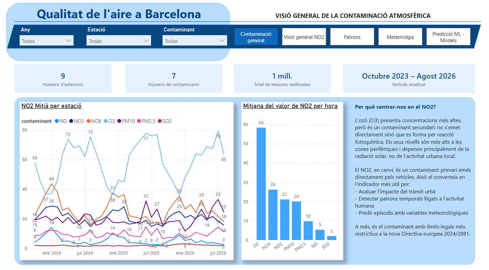
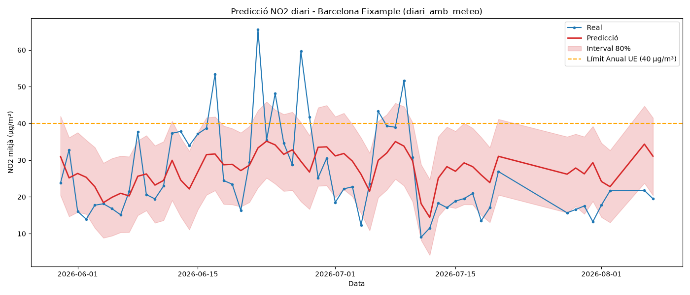

# Qualitat de l'aire a Barcelona

Pipeline ELT complet que integra dades de contaminació atmosfèrica i meteorologia, amb modelatge predictiu de NO2 i dashboard interactiu.

## Dashboard

## Arquitectura

Dues fonts heterogènies → Python → DuckDB (Bronze/Silver/Gold) → Power BI + Machine Learning

## Fonts de dades

- **Transparència Catalunya** (API Socrata): qualitat de l'aire dels punts de mesurament automàtics de la XVPCA
- **Open-Meteo** (API): dades meteorològiques horàries de Barcelona

## Volum

- 1.104.785 mesures horàries processades
- 25.848 registres meteorològics
- 9 estacions de mesura
- 8 contaminants
- 3 anys d'històric (2023-2026)

## Stack tècnic

- **Python** + Pandas → extracció de les APIs
- **DuckDB** → emmagatzematge analític amb arquitectura Bronze/Silver/Gold
- **SQL** → transformacions (UNPIVOT de 24 columnes horàries, neteja, star schema)
- **Prophet** + **XGBoost** → modelatge predictiu
- **MLflow** → registre i comparació d'experiments
- **Power BI** → dashboard interactiu de 5 pàgines
- **Windows Task Scheduler** → automatització del pipeline

## Qualitat de dades

El pipeline inclou 7 tests automàtics que validen rangs de coordenades, hores, temperatures i absència de nuls crítics. Durant el desenvolupament es van detectar i corregir:

- Coordenades mal escalades (factor 100.000) en una estació
- Estacions duplicades per inconsistències en les coordenades
- Contaminants duplicats per diferències d'encoding en les unitats (ug/m³ vs µg/m³)

## Modelatge predictiu

Objectiu: predir la mitjana diària de NO2 a l'estació de l'Eixample.

| Model | MAE | RMSE | R² |
|---|---|---|---|
| Prophet sense meteo | 10,07 | 13,37 | -0,120 |
| Prophet amb meteo | 8,54 | 10,62 | 0,293 |
| XGBoost amb lags | 8,94 | 10,75 | 0,276 |

Incorporar variables meteorològiques millora el model un 15%. Sense elles, el R² negatiu indica que el model no supera la mitjana històrica.

## Principals troballes

- El vent és el factor meteorològic determinant: amb vent fort el NO2 baixa un 48%
- Els dies de pluja el NO2 es redueix un 24%
- El perfil horari mostra dos pics coincidents amb les hores punta de trànsit
- Les estacions de trànsit tripliquen els valors de les estacions de fons
- Totes les estacions superen la guia OMS 2021 (10 µg/m³) excepte l'Observatori Fabra

## Estructura del projecte
